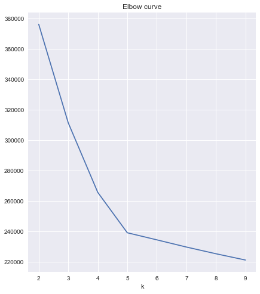
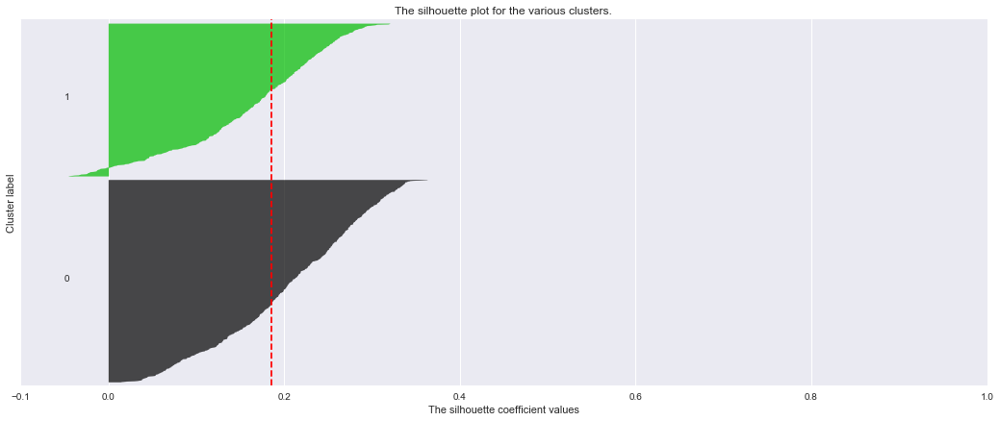
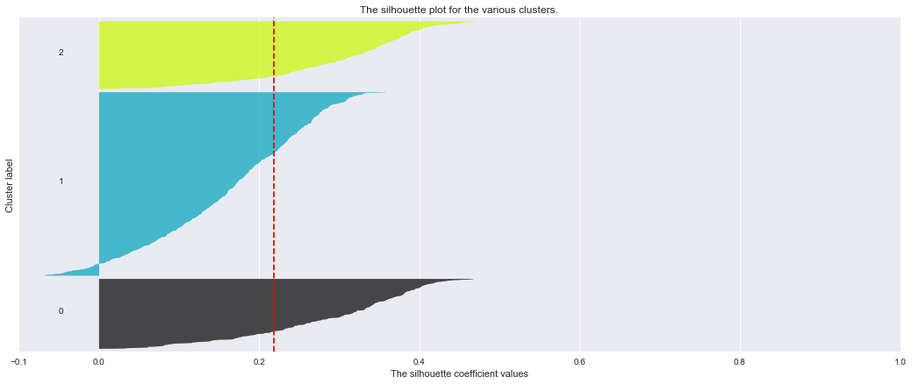
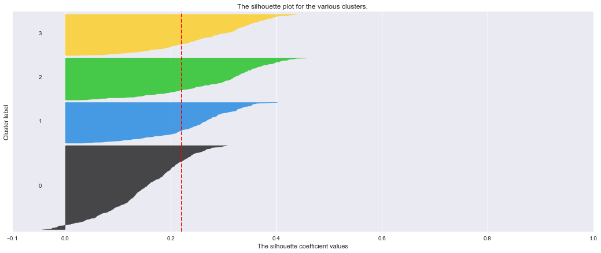
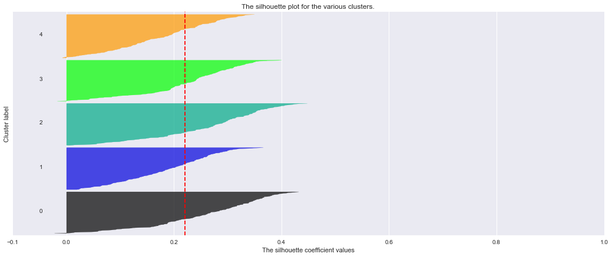
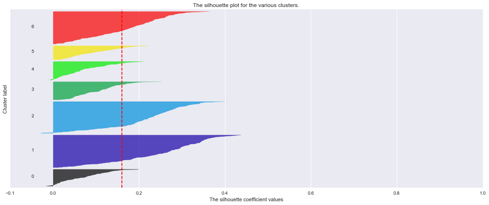
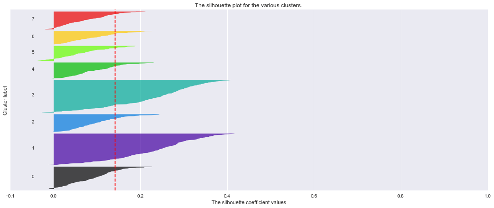
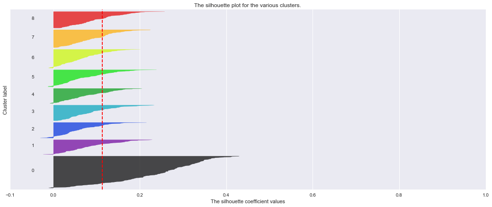

# Gotta lock those centroids down


```python
from sklearn.preprocessing import StandardScaler

from sklearn.cluster import KMeans
from sklearn import metrics
from sklearn.metrics import silhouette_samples, silhouette_score, plot_confusion_matrix
import matplotlib.cm as cm

# Familiar packages for plotting, data manipulation, and numeric functions
import matplotlib.pyplot as plt
import pandas as pd
import numpy as np

# Have plots appear in notebook
%matplotlib inline

# Default plot params
plt.style.use('seaborn')
cmap = 'tab10'

from test_scripts.test_class import Test
test = Test()

# Read in data
X = test.load_ind('X.pkl')
y = test.load_ind('y.pkl')
```

### Create an Elbow Curve plot

- For k from 2 to 10:
  - fit a `KMeans` object with `k` clusters and `random_state` 301
  - save the sum of squared distance for all points to the centroids of their respective cluster in a list
    - *Hint*: [read the docs](https://scikit-learn.org/stable/modules/generated/sklearn.cluster.KMeans.html)
    
    
- Graph the values you saved on the `Y axis` w/ `k` on the `X axis`

In general, what type of information do you diagnose from an Elbow Curve plot?

For this specific graph, what conclusions can you make?


```python

distorsions = []

# Calculate SSE for different K
for k in range(2, 10):
    kmeans = KMeans(n_clusters=k, random_state = 301)
    kmeans.fit(X)
    distorsions.append(kmeans.inertia_)

# Plot values of SSE
plt.figure(figsize=(15,8))
plt.subplot(121, title='Elbow curve')
plt.xlabel('k')
plt.plot(range(2, 10), distorsions)
plt.grid(True)

print('''
    From an Elbow Curve graph we try and find the best
    value for k
    
    From this specific graph, looks like it's 5
''')
```

    
        From an Elbow Curve graph we try and find the best
        value for k
        
        From this specific graph, looks like it's 5
    





### Further diagnosis with silhouette plots

Use the code below to create a silhouette plot for `k` from 2 to 8

What conclusions can you draw?

What implications does this have for interpreting the Elbow Curve graph?


```python

def silhouette_plot(n_clusters, cluster_labels, X):
    
    # Create a subplot with 1 row and 2 columns
    fig, (ax1) = plt.subplots(1)
    fig.set_size_inches(18, 7)

    # The 1st subplot is the silhouette plot
    # The silhouette coefficient can range from -1, 1 but in this example all
    # lie within [-0.1, 1]
    ax1.set_xlim([-0.1, 1])
    # The (n_clusters+1)*10 is for inserting blank space between silhouette
    # plots of individual clusters, to demarcate them clearly.
    ax1.set_ylim([0, len(X) + (n_clusters + 1) * 10])

    # The silhouette_score gives the average value for all the samples.
    # This gives a perspective into the density and separation of the formed
    # clusters
    silhouette_avg = silhouette_score(X, cluster_labels)
    print("For n_clusters =", n_clusters,
          "The average silhouette_score is :", silhouette_avg)

    # Compute the silhouette scores for each sample
    sample_silhouette_values = silhouette_samples(X, cluster_labels)

    y_lower = 10
    for i in range(n_clusters):
        # Aggregate the silhouette scores for samples belonging to
        # cluster i, and sort them
        ith_cluster_silhouette_values = \
            sample_silhouette_values[cluster_labels == i]

        ith_cluster_silhouette_values.sort()

        size_cluster_i = ith_cluster_silhouette_values.shape[0]
        y_upper = y_lower + size_cluster_i

        color = cm.nipy_spectral(float(i) / n_clusters)
        ax1.fill_betweenx(np.arange(y_lower, y_upper),
                          0, ith_cluster_silhouette_values,
                          facecolor=color, edgecolor=color, alpha=0.7)

        # Label the silhouette plots with their cluster numbers at the middle
        ax1.text(-0.05, y_lower + 0.5 * size_cluster_i, str(i))

        # Compute the new y_lower for next plot
        y_lower = y_upper + 10  # 10 for the 0 samples

    ax1.set_title("The silhouette plot for the various clusters.")
    ax1.set_xlabel("The silhouette coefficient values")
    ax1.set_ylabel("Cluster label")

    # The vertical line for average silhouette score of all the values
    ax1.axvline(x=silhouette_avg, color="red", linestyle="--")

    ax1.set_yticks([])  # Clear the yaxis labels / ticks
    ax1.set_xticks([-0.1, 0, 0.2, 0.4, 0.6, 0.8, 1])
    
    plt.show()
```


```python

for clus_num in range(2,10):
    kmeans = KMeans(n_clusters=clus_num, random_state = 301)
    kmeans_labels = kmeans.fit_predict(X)
    silhouette_plot(clus_num, kmeans_labels, X)
    
print('''
    5, indeed, seems like the right number of clusters
    
    It's essentiall tied for highest avg silhouette coefficient,
    meaning that on avg the points are closer
    to their respective cluster centroids than other 
    cluster centroids for most other numbers of clusters.
    
    More importantly, the silhouette sample plots of each
    point result in fairly similar distributions across
    each cluster, indicating no one cluster is more
    or less well-defined than any other.  This provides
    an advantage over 4 clusters, where one of the clusters
    has a larger number of points with lots of low 
    silhouette scores, indicating a large, spread-out, 
    ill-defined cluster.
    
    Additional interpretation: the average silhouette score is fairly low
    (.22 on a scale that goes to 1), indicating a fair 
    amount of overlap among the clusters
    
    Since the Elbow Curve graph was so well-defined for
    5 clusters, this means that the "sharpness" of the 
    kink in the Elbow Curve graph can't be used as a 
    guide for how much overlap is generated by that
    number of clusters 
''')
```

    For n_clusters = 2 The average silhouette_score is : 0.1856698136169719





    For n_clusters = 3 The average silhouette_score is : 0.21796202096394005





    For n_clusters = 4 The average silhouette_score is : 0.22055481994703005





    For n_clusters = 5 The average silhouette_score is : 0.22057361009832313





    For n_clusters = 6 The average silhouette_score is : 0.18849021228146268


    For n_clusters = 7 The average silhouette_score is : 0.15998133847616905





    For n_clusters = 8 The average silhouette_score is : 0.14177484246966918





    For n_clusters = 9 The average silhouette_score is : 0.1129280628179777





    
        5, indeed, seems like the right number of clusters
        
        It's essentiall tied for highest avg silhouette coefficient,
        meaning that on avg the points are closer
        to their respective cluster centroids than other 
        cluster centroids for most other numbers of clusters.
        
        More importantly, the silhouette sample plots of each
        point result in fairly similar distributions across
        each cluster, indicating no one cluster is more
        or less well-defined than any other.  This provides
        an advantage over 4 clusters, where one of the clusters
        has a larger number of points with lots of low 
        silhouette scores, indicating a large, spread-out, 
        ill-defined cluster.
        
        Additional interpretation: the average silhouette score is fairly low
        (.22 on a scale that goes to 1), indicating a fair 
        amount of overlap among the clusters
        
        Since the Elbow Curve graph was so well-defined for
        5 clusters, this means that the "sharpness" of the 
        kink in the Elbow Curve graph can't be used as a 
        guide for how much overlap is generated by that
        number of clusters 
    


### Optional

The data was artificially generated, so the "actual" centroids
are known.

A variable `y` has been loaded and contains the "actual" centroids.  

Compare your computed centroids against the actual ones.

Can you manipulate the X data in such a way to generate closer
centroids with KMeans?
